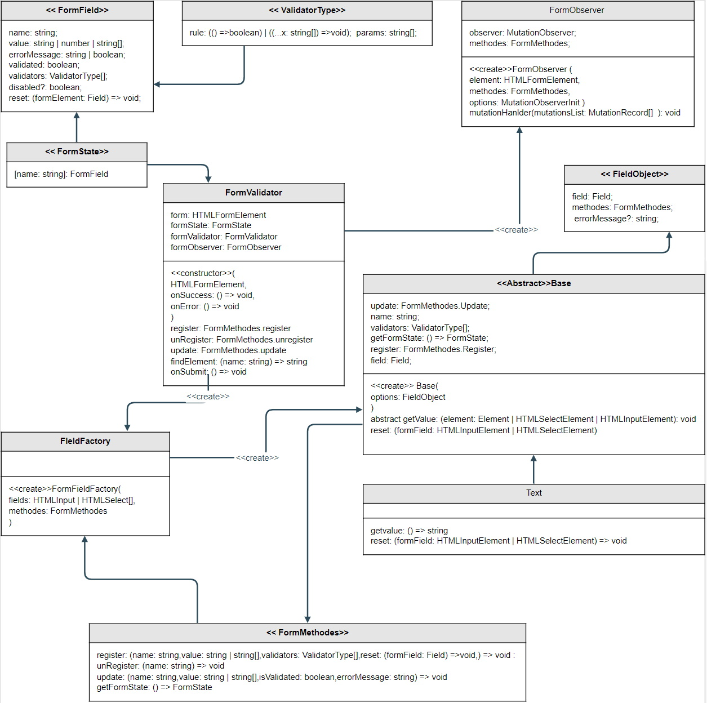

# FormValidator


## Introduction

Form validator (Mediator pattern) represents a class that validates form fields.

## Schema




## Example
https://codesandbox.io/s/form-validator-15nzv3

## Walkthrough
- `FormValidator` - main class which controls the states and behavior of the participants (form fields)
  - `register` - which register form field into state
  - `unRegister` - removes values and validation state from form state
  - `update` - updates field values in form state with latest change
  - `onSubmit` - validate, and trigger callbacks. If form has error `onError` if not `onSuccess`
- `FieldFactory` - Register field into state based on field type. We can register any kind of field based on native type or we can add something like data-type if there is need.
  - `Abstract Base class` - blueprint of what the derived class should have
    - `abstract getValue` - the way the class get value of the field. We can use different plug-ins and define in classes how they pick up values. 
    - Each class can have different listener and handler method for change/get values from field. In examples we present `change` event.
- `FormObserver` - Observes the form whether a field has been added, removed, shown or hidden.

## Field class structure
```js
import Base from './base';
import { FieldObject } from '../form.interface';

export default class YourField extends Base {
  constructor(options: FieldObject) {
    super(options);
    this.register(
      this.name,
      this.getValue(),
      this.reset,
      this.validate,
    );

    // Update on Change
    this.field.addEventListener([EVENT_NAME], (event) => this.onChange(event.target));
  }

  getValue(): string | string[] | FileList; // Get value from form field

  validate(): void; // validate field based on value and validators

  reset = () => {
    ... // reset field value to default or ''
    super.reset();
  };
}
```
